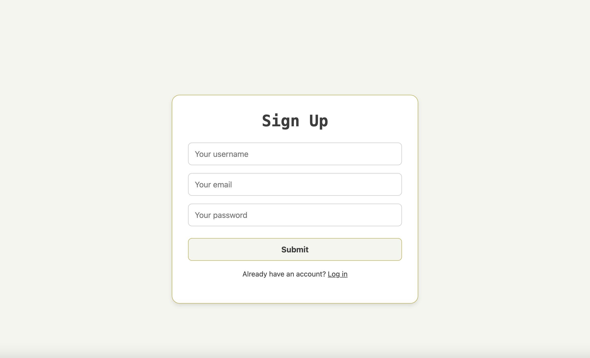
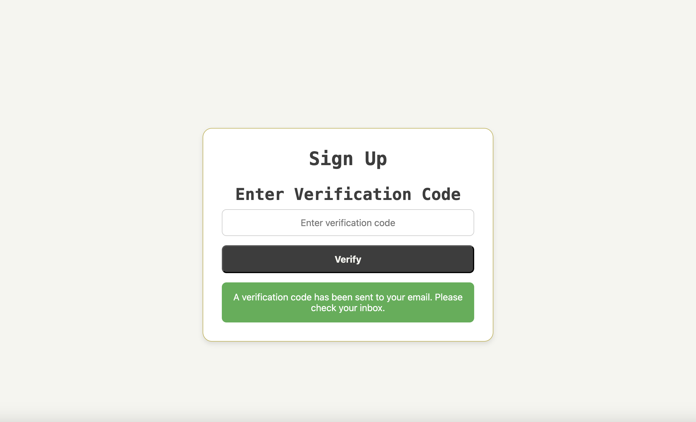
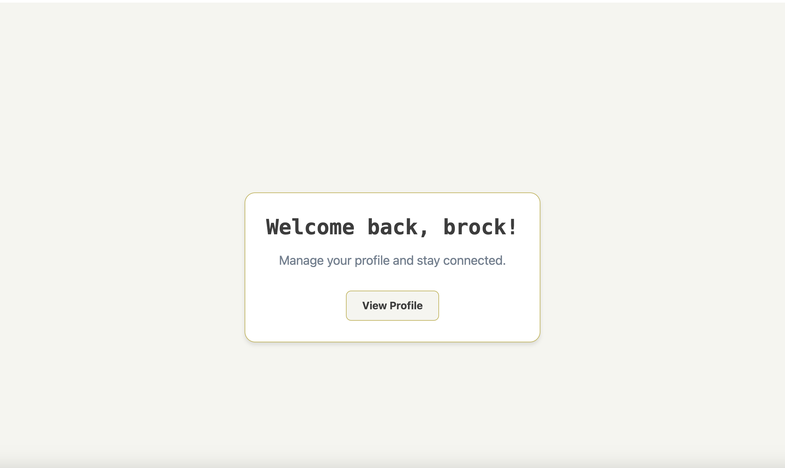

# **Auth Login/Signup with Email Verification (MERN + GraphQL + Nodemailer)**

## **Table of Contents**

1. [Overview](#overview)
2. [Concepts Covered](#concepts-covered)
3. [Learning Objectives](#learning-objectives)
4. [Technologies Used](#technologies-used)
5. [Features](#features)
6. [Setup and Installation](#setup-and-installation)
   - [Prerequisites](#prerequisites)
   - [Steps to Run Locally](#steps-to-run-locally)
7. [Summary](#summary)

---

## **Overview**

This **Auth Login/Signup** system is a **MERN-stack** (MongoDB, Express.js, React, Node.js) web application with **GraphQL authentication** and **Nodemailer-powered email verification**.  
Users can **sign up, receive a verification code via email, enter the code to verify their account, and then log in securely**.

This app follows **best authentication practices** to prevent fake email registrations, ensuring that only **verified users** can log in.

---

📸 **Screenshots:**

- **Signup Page**  
  

- **Email Verification Modal**  
  

- **Login Page**  
  

---

## **Concepts Covered**

### **1 - GraphQL Authentication**

- Uses **Apollo Server** to handle user authentication in a structured **GraphQL API**.

### **2 - Secure Email Verification**

- Users receive a **6-digit verification code** to their email using **Nodemailer**.
- **Prevents spam** and **fake account registrations**.

### **3️ - JWT Authentication**

- Users receive a **JWT token** after verifying their email.
- The token is stored securely for **protected routes**.

### **4️ - React State Management**

- **State management with `useState`** for real-time UI updates.
- **Modal handling** for email verification.

### **5️ - Environment Variables (`.env`)**

- Securely manages **email credentials and database URIs**.

---

## **Learning Objectives**

- Understand how to integrate **GraphQL authentication** in a **MERN app**.
- Learn **JWT-based authentication** and **secure session management**.
- Implement **email verification** using **Nodemailer SMTP service**.
- Use **Apollo Client** in **React** for GraphQL-based authentication.
- Handle **protected routes** and **role-based access** for verified users.

---

## **Technologies Used**

| Technology        | Purpose                                      |
| ----------------- | -------------------------------------------- |
| **MongoDB**       | Database for storing user credentials        |
| **Express.js**    | Backend framework for API handling           |
| **React**         | Frontend UI for user authentication          |
| **Node.js**       | JavaScript runtime for backend logic         |
| **GraphQL**       | Query language for flexible data fetching    |
| **Apollo Server** | GraphQL server for authentication            |
| **Apollo Client** | Client-side GraphQL for React                |
| **JWT**           | JSON Web Token for secure authentication     |
| **Nodemailer**    | SMTP service for sending verification emails |
| **dotenv**        | Manages environment variables (.env)         |
| **bcrypt**        | Hashes and secures user passwords            |

---

## **Features**

✅ **Secure User Signup with Email Verification**  
✅ **6-Digit Code Sent to User's Email (Nodemailer)**  
✅ **Prevents Fake Email Registrations**  
✅ **Only Verified Users Can Log In**  
✅ **JWT Authentication for Secure Sessions**  
✅ **GraphQL API for Signup, Login, and Verification**  
✅ **Frontend React UI with Real-Time State Management**  
✅ **Error Handling for Invalid Logins or Expired Codes**  
✅ **Full `.env` Config Support for Deployment**

---

## **Setup and Installation**

### **Prerequisites**

- **Node.js** (v14 or later)
- **MongoDB** (local or Atlas instance)
- **A Gmail Account** (or SMTP credentials for Nodemailer)

---

### **Steps to Run Locally**

#### **1 - Install Backend Dependencies**

```sh
cd server
npm install
```

#### **2 - Install Frontend Dependencies**

```sh
cd ../client
npm install
```

#### **3 - Configure Environment Variables (`.env`)**

Create a **`.env`** file in the **`server`** directory and add:

```plaintext
MONGODB_URI=mongodb://127.0.0.1:27017/authlogin_app
JWT_SECRET=your_jwt_secret
PORT=3001

# Email Credentials (Use Gmail SMTP or another provider)
EMAIL_USER=your-email@gmail.com
EMAIL_PASS=your-email-app-password
```

🚀 **For Gmail users**: Enable [App Passwords](https://myaccount.google.com/apppasswords) in your Google account.

#### **5️⃣ Start the Application**

```sh
npm run develop
```

The backend will run on **`http://localhost:3001/graphql`**  
The frontend will run on **`http://localhost:3000`**

---

## **Summary**

This **Auth Login/Signup with Email Verification** project **combines GraphQL authentication with JWT and Nodemailer-powered email verification**. It ensures **secure and verified user authentication** while preventing **fake registrations**.

With a **MERN + GraphQL** architecture and **Apollo Client for state management**, the app **offers a seamless user experience**.

🚀 **Now you're ready to build full-scale authentication systems with email verification!** 🎯
